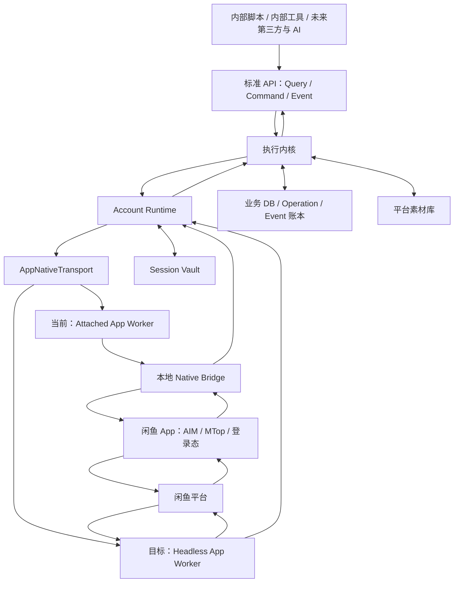

# XianYuApis 总体架构

- 层级：L2
- 状态：Draft
- 更新时间：2026-07-28

## 架构目标

建立与具体 AI、商业模式和物理设备解耦的闲鱼能力基座。调用者只面对稳定的 Query、Command 和 Event 契约；底层负责选择执行路径、维护账号状态、确认闲鱼结果并保存本地业务账本。

## 架构原则

- API 能力层与 AI/业务决策层分离。
- 每个核心 Command 只操作一个 `account_id`。
- 接收 Command 不代表闲鱼操作成功。
- 闲鱼是平台状态来源，本地保存标准化副本和历史账本。
- 一个闲鱼账号对应一个逻辑 Account Runtime。
- Account Runtime 与物理设备解耦，但账号状态和凭证隔离。
- 账号托管生命周期与 Runtime 运行状态使用两个正交状态机。
- 生产执行只使用 App 原生协议、登录态和设备态；Web/Cookie 不参与生产执行或回退。
- 第一阶段 API 只在本机、内网或 VPN 中提供，契约按未来公开 API 的质量设计。

## 逻辑分层



## 1. 标准 API 层

标准 API 是业务调用者唯一依赖的生产接口。

API 只暴露标准化领域对象和稳定 schema，不直接暴露 AIM、MTop、Objective-C 或 Flutter 原始对象。原始 App 数据保存在适配层证据记录中，并通过内部 `raw_ref` 与标准对象关联。

### 通信协议

- Query、Command、Operation 和 Capability Discovery 使用 HTTP + JSON；
- 第一阶段事件流使用 SSE，并通过事件 ID/游标支持断线续传；
- 未来可以增加 WebSocket 或 Webhook，但不改变 Event schema；
- 执行内核与 Attached App Worker 之间继续使用 Unix Domain Socket + JSONL；
- 对外标准 API 和内部 App 桥协议分别版本化。

### Query API

- 查询账号、会话、消息、商品、订单、评价和 Operation；
- 默认读取本地标准化状态；
- 对强一致要求较高的查询，可以触发目标账号实时刷新；
- 支持 `consistency: local | fresh`；
- 返回数据来源、最后观察时间、同步游标和完整性状态。

### Capability Discovery

调用者可以按账号查询当前能力：

```text
GET /accounts/{account_id}/capabilities
```

每项能力返回名称、可用状态、App 版本、Worker 类型和验证级别。状态至少包括 `available`、`needs_login`、`app_version_unsupported`、`not_verified` 和 `temporarily_unavailable`。

### Command API

- 接收目标 `account_id`、Capability、参数和幂等键；
- 接收并验证调用者 `actor_id` 与 `actor_type`；
- 校验后创建 Operation；
- 先返回 `accepted + operation_id`；
- 最终结果通过 Operation Query 或 Event 返回。
- 目标 Runtime 离线时默认快速返回 `runtime_unavailable` 或 `needs_login`；
- 只有调用者显式指定等待策略时，Command 才在有限截止时间内等待 Runtime 恢复。

### Event API

- 输出闲鱼主动事件、账号状态事件和 Operation 状态事件；
- 支持断线续传和消费游标；
- 第一阶段可以使用 WebSocket、SSE 或内部事件流，具体协议在 API 契约阶段确定。

### 第一阶段访问边界

- 只向内部脚本、测试工具和内部客户端开放；
- 使用本机权限、内网身份或服务 Token；
- 暂不建设公开注册、开发者门户、计费和外部租户系统。
- 私有 API 的权限模型可以先保持简单，但每次业务操作都必须保留调用者身份。

## 2. 执行内核

### Capability Registry

记录当前版本支持的 Capability、参数 schema、结果 schema、所需账号状态、可用 App Worker 实现和验证级别。

同时记录每项 Capability 对应的 App 版本范围、Worker 版本、已验证状态和失配原因。App 升级后，适配层先更新注册表，再决定能力是否可用。

每个 Capability 同时声明执行等级：

```text
normal
sensitive
destructive
```

等级用于决定确认字段、目标版本校验、审计强度和权限要求，不包含业务策略。

### Command Handler

负责参数校验、权限校验、幂等检查和 Operation 创建，不包含业务策略。

`sensitive` 和 `destructive` Command 需要按 Capability 定义校验明确确认、目标对象当前版本和操作原因。这样可以阻止过期请求或重复提交作用于已经变化的对象。

高影响 Command 默认先读取目标对象的最新状态，并支持 `expected_version` 校验；版本冲突时返回冲突结果，由调用者重新查询。

### Operation Manager

维护执行状态、超时、执行级重试、最终结果和错误信息。

建议基础状态：

```text
accepted
→ queued
→ running
→ succeeded
  failed
  timed_out
  needs_login
  needs_verification
  cancelled
```

离线处理原则：

- 不把 Command 静默无限排队；
- 消息发送等时效操作默认快速失败；
- 改价、上下架等任务可以由调用者显式选择 `wait_until_online`；
- 所有等待都必须包含截止时间，超时后进入明确终态。

### Event Dispatcher

把闲鱼事件、Runtime 事件和 Operation 事件持久化后分发给内部调用者。

### Idempotency Store

避免调用者重试、网络重发或桥重复回调导致重复发消息、重复改价和重复发布。

## 3. Account Runtime

每个闲鱼账号拥有一个逻辑 Runtime。

```text
Account Runtime
├── account lifecycle
├── session reference
├── stable device profile reference
├── runtime state machine
├── per-account operation queue
├── resource serialisation
├── sync cursors
├── app worker binding
├── external/manual change observer
└── health and heartbeat
```

职责：

- 维护账号在线、暂停、需要登录和人工操作模式；
- 保证同一资源上的冲突操作串行执行；
- 绑定并管理当前 App Worker；
- 在 Worker 重启或迁移时继续使用该账号已绑定的 Device Profile；
- 断线后恢复连接和补齐事件；
- 同步账号主手工操作产生的外部变化；
- 在多 Worker 形态下确保一个账号只有一个活动执行租约。

Runtime 不保存可直接读取的明文凭证，只持有 Session Vault 引用。

### 账号生命周期与 Runtime 状态

系统分别保存：

```text
account_lifecycle_state
  pending → authorizing → hosted ↔ paused → ending → ended

runtime_state
  offline → starting → connecting → online ↔ degraded
  online/degraded → needs_login | needs_verification | manual_control
  online/degraded/manual_control → draining → offline
```

`hosted` 只表示托管关系有效，不代表 App 或 Worker 当前在线。Command Handler 同时检查两个状态和 Capability 声明后再决定执行、限制或返回结构化状态。完整契约见 `docs/api/SESSION_RUNTIME_V1.md`。

## 4. App 原生执行层

统一内部接口示意：

```text
query(account, capability, params)
execute(account, capability, params, operation_id)
subscribe(account, cursor)
health(account)
```

### AppNativeTransport

- 标准 API 与 App Worker 之间唯一的生产执行契约；
- 复用 App 原生登录态、设备态、AIM/ACCS 和 MTop 能力；
- 对上层隐藏真实 App 进程和 Headless Worker 的实现差异；
- 把不同 App 版本的原始字段转换为标准领域对象；
- 第一阶段优先完成原生 IM 收发。

Headless Worker 的内部边界和 `start_session`、`health`、`query`、`execute`、`subscribe`、`stop_session` 方法见 `docs/HEADLESS_WORKER.md`。Runtime 持有队列、同步、Operation 和账本；Worker 只持有单账号原生连接和执行能力。

### Attached App Worker

- 当前验证实现；
- 运行真实闲鱼 App；
- 通过 Native Bridge 接收 App 回调和执行原生调用；
- 用于确认字段、状态机、登录态和协议行为。

### Headless App Worker

- 长期目标实现；
- 复用 App 原生协议、登录态、设备态、心跳和同步机制；
- 不依赖真实 App 图形进程；
- 上层 API 不感知底层从 Attached App Worker 切换为 Headless App Worker。

### 交互式登录协调器

Headless 只描述日常运行形态，不要求首次登录和平台验证完全无人参与。

```text
创建登录会话
→ 账号主扫码或完成平台验证
→ 收集 App Session 与设备态
→ 加密写入 Session Vault
→ Headless App Worker 接管
```

登录失效或平台要求重新验证时，账号生命周期继续保持 `hosted`，Runtime 进入 `needs_login` 或 `needs_verification`。登录协调器通知账号主完成交互，随后 Runtime 回到 `connecting` 并恢复 Headless 运行。

### Web/Cookie 代码边界

`xianyu_web/` 不实现 AppNativeTransport，也不参与生产 Query、Command、Event 或故障回退。它只保留历史研究、数据导出和对照用途。

## 5. Native Bridge

Native Bridge 只负责闲鱼 App 与 Account Runtime 之间的协议转换：

- App 回调转换为标准 Event；
- Runtime Command 转换为已验证的 AIM/MTop 调用；
- 返回进度、成功、失败和错误码；
- 不承担业务判断、账号编排或 AI 逻辑。

当前 `/xianyu_app/bridge/` 的 Unix Socket + JSONL POC 是该组件的第一版验证实现。

## 6. 数据层

### 业务 DB

保存标准化账号、商品、买家、会话、消息、订单、评论、评价和同步游标。

### Operation / Event 账本

保存所有 Command 的执行过程和所有外部事件。第一阶段可以与业务 DB 使用同一数据库，但逻辑模型保持分离。

每个 Operation 至少记录 `actor_id`、`actor_type`、`account_id`、Capability、参数摘要、幂等键、执行时间、结果和实际 App Worker。敏感参数只保存脱敏摘要。

标准对象可以保存内部 `raw_ref` 指向对应 App 原始证据。普通 API 响应不返回原始对象；诊断工具按内部权限读取。

### Session Vault

单独保存 App 登录票据、设备身份、密钥引用和连接恢复资料。业务 API、日志和普通查询不返回这些内容。

每个账号绑定独立且稳定的 Device Profile。Worker 重启或迁移时，Session 与 Device Profile 作为同一账号会话包迁移。设备身份轮换是显式操作，需要记录原因、前后版本和重新登录结果。

### 平台素材库

保存原始图片、视频、音频和文件，并维护各账号对应的闲鱼媒体实例。

### 结束托管后的数据生命周期

- 立即清除登录票据、Device Profile 私密内容、App 密钥、连接状态和 Worker 缓存；
- 在结算与审计周期内保留必要的操作、商品、订单、收益和错误记录；
- 支持账号主导出与自己账号相关的数据；
- 保留期结束后删除或匿名化业务数据；
- 所有清除、导出、删除和匿名化动作进入审计账本。

## 第一阶段实现形态

第一阶段采用单机模块化单体，不提前拆分微服务：

```text
Python 异步服务进程
├── HTTP/JSON + SSE API
├── Capability Registry
├── Command / Operation Manager
├── Account Runtime Manager
├── Event Dispatcher
├── Sync Engine
└── Repository / Vault adapters

独立本地进程
└── Attached App Worker / Native Bridge
```

- API、执行内核、单账号 Runtime 和同步逻辑先运行在同一服务进程；
- Native Bridge 保持独立，避免 App 插桩或原生崩溃直接带走 API 服务；
- 第一阶段业务 DB 使用本地关系型数据库和 WAL 模式，逻辑上分离业务表、Operation 和 Event；
- 平台素材保存于本地受控目录，DB 记录哈希、元数据和引用；
- Session Vault 使用独立加密存储和 macOS 安全能力保存密钥引用；
- 模块边界与未来多 Worker 部署一致，后续可以逐个拆出，不改变 API 契约。

## 可靠性语义

### Operation 持久化

- Command 校验通过后，先持久化 Operation，再进入账号队列；
- App 调用前记录 `running` 和 Worker 信息；
- 回调、超时和状态观察都追加事件，不覆盖历史证据；
- 服务重启后扫描非终态 Operation，并根据能力语义恢复、查询或结束。

### Event 投递

- Event 采用至少一次投递；
- 每个 Event 有稳定 `event_id`、`account_id`、类型、时间和游标；
- 调用者按 `event_id` 去重，并通过游标恢复消费；
- Event 先写入账本，再推送 SSE。

### Command 幂等

- 所有写 Command 需要幂等键；
- 相同 Actor、账号、Capability 和幂等键返回原 Operation；
- 幂等记录的保留时间由能力声明；
- 发送消息、发布商品、发货等能力使用业务侧唯一标识辅助去重。

### 单账号执行租约

- 同一账号在任意时刻只有一个活动执行租约；
- Worker 故障后，租约过期并由恢复流程接管；
- 新 Worker 接管前先恢复 Session、Device Profile、游标和非终态 Operation；
- 同一会话、商品或订单上的冲突操作通过资源键串行化。

## 核心数据流

### Command

```text
调用者
→ Command API
→ 参数与幂等校验
→ 创建 Operation
→ Account Runtime 队列
→ AppNativeTransport
→ 闲鱼
→ 成功回调或状态观察
→ Operation 终态
→ Event 通知调用者
```

### Event

```text
闲鱼主动变化
→ App 原生回调或 Headless Worker 事件
→ AppNativeTransport 标准化
→ 去重和账号归属确认
→ Event 账本
→ 更新本地业务状态
→ 通知调用者
```

### Query

```text
调用者
→ Query API
→ 本地标准化状态
→ 返回数据来源、同步时间和完整性
→ 必要时触发实时刷新
```

## 首次同步与恢复

- 账号首次接入建立商品、会话、消息、订单和评价快照；
- 初始同步按“商品 → 会话与消息 → 订单与评价”调度，并为三个域分别建立 `SyncJob`、同步游标、检查点和缺口；
- 各业务域可以独立完成、失败、重试和补偿；
- 数据量较大时后台补齐历史；
- Runtime 重启后恢复未完成 Operation 和同步游标；
- 闲鱼状态与本地状态冲突时，以重新观察到的闲鱼状态为准，并记录差异事件。

## 部署演进

### 第一阶段：单机单账号（已确认）

```text
一台 Mac
├── 私有 API 服务
├── 执行内核
├── 本地业务 DB
├── 单个 Account Runtime
├── Native Bridge
└── 闲鱼 App
```

目标是完成真实单账号 Query、Command、Event 闭环。

### 第二阶段：单账号 Headless App Worker

- 复现真实 App 已验证的登录、恢复、心跳、Query、Command 和 Event；
- 标准 API 和业务账本保持不变；
- 对比 Attached App Worker 与 Headless App Worker 的结果一致性。

### 第三阶段：单机多 Runtime

- 运行多个逻辑 Account Runtime；
- 验证账号隔离、资源限制和会话恢复；
- 验证多个 Headless App Worker 的承载密度和故障隔离。

### 第四阶段：控制平面与 Worker

```text
私有 API / 控制平面
        ↓
Account Runtime Scheduler
        ↓
Worker / Mac / 设备池
```

- 控制平面负责账号放置、健康检查和故障迁移；
- Worker 只执行单账号 Command；
- AI、批量策略和商业编排继续位于能力 API 之上。

## 当前代码映射

| 逻辑组件 | 当前位置 |
| --- | --- |
| Native Bridge POC | `xianyu_app/bridge/` |
| App 动态探针 | `xianyu_app/hooks/` |
| App 研究和证据 | `xianyu_app/docs/`、`xianyu_app/research/` |
| 历史 Web/Cookie 参考 | `xianyu_web/goofish_live.py`、`xianyu_web/goofish_apis.py`；不进入生产执行层 |
| 标准 API / 执行内核 | 待实现 |
| 业务 DB / Event 账本 | 待设计 |
| Session Vault | 待设计 |

## 下一步设计

- 实现已确认的第一阶段单机单账号骨架；
- 定义标准 API 的资源、错误和 Operation schema；
- 按 `docs/api/SESSION_RUNTIME_V1.md` 实现账号生命周期、Runtime 状态机和执行租约；
- 把现有 Native bridge 接入真实 AIM 回调；
- 抽取当前 Attached App Worker 使用的 `AppNativeTransport` 接口。
